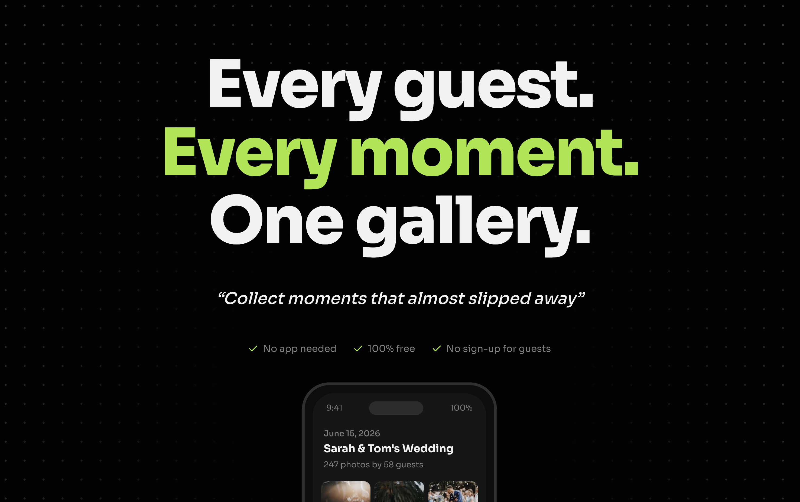

# Almost Moments

> Collect moments that almost slipped away

**Every guest. Every moment. One gallery.**

Almost Moments is a free, web-based photo gallery for events. Create a gallery, share a QR code, and let every guest upload their photos and videos — no app download, no account required.



## How It Works

1. **Create a gallery** — Give your event a name and get a unique link + QR code in seconds
2. **Share the QR code** — Print it, display it, or send the link to your guests
3. **Guests upload photos** — No app, no account. They open the link and upload from their phone
4. **Enjoy every moment** — All photos and videos from every guest, together in one beautiful gallery

## Features

**For guests (zero friction):**

- No app to download — works in any browser
- No account to create
- Scan QR code and start uploading instantly
- Browse all photos in a masonry gallery with lightbox
- Download individual photos or the entire gallery as a ZIP

**For organizers:**

- Create unlimited galleries, 100% free
- Customizable gallery name, description, and cover image
- Configurable expiry dates (1 week, 2 weeks, 1 month, 1 year, forever, or custom)
- Print-ready QR codes
- Dashboard to manage all your galleries
- Search, filter, and favourite galleries

**Under the hood:**

- Blurhash placeholders for smooth image loading
- Concurrent uploads (up to 5 simultaneous) with retry logic
- Infinite scroll pagination
- Mobile-first responsive design
- Dark mode support
- View Transitions API for smooth navigation
- Client-side ZIP generation with progress tracking

## Tech Stack

| Category        | Technology                                     |
| --------------- | ---------------------------------------------- |
| Framework       | [Next.js](https://nextjs.org/) 16 (App Router) |
| UI              | React 19, Tailwind CSS 4, shadcn/ui            |
| Backend         | [Appwrite](https://appwrite.io/) (BaaS)        |
| Language        | TypeScript                                     |
| Image Gallery   | react-photo-album + yet-another-react-lightbox  |
| QR Codes        | qrcode                                         |
| ZIP Downloads   | JSZip                                          |
| Package Manager | [Bun](https://bun.sh/)                         |

## Getting Started

### Prerequisites

- [Bun](https://bun.sh/) (or Node.js 20+)
- An [Appwrite](https://appwrite.io/) project (for auth, database, and storage)

### Installation

```bash
# Clone the repository
git clone https://github.com/your-username/almost-moments.git
cd almost-moments

# Install dependencies
bun install

# Start the development server
bun run dev
```

Open [http://localhost:3000](http://localhost:3000) to see it running.

### Scripts

| Command          | Description               |
| ---------------- | ------------------------- |
| `bun run dev`    | Start development server  |
| `bun run build`  | Build for production      |
| `bun run start`  | Start production server   |
| `bun run lint`   | Run ESLint                |
| `bun run format` | Format code with Prettier |

## Project Structure

```
almost-moments/
├── app/
│   ├── (auth)/              # Sign-in, sign-up, OAuth, magic link
│   ├── (dashboard)/         # Protected dashboard & gallery management
│   ├── api/v1/galleries/    # API routes
│   ├── g/[galleryId]/       # Public gallery view
│   └── page.tsx             # Landing page
├── components/
│   ├── ui/                  # shadcn/ui components
│   └── seo.tsx              # SEO meta tags
├── lib/
│   ├── appwrite.ts          # Client-side Appwrite SDK
│   ├── appwrite-server.ts   # Server-side Appwrite SDK
│   ├── auth-context.tsx     # Auth state context
│   └── view-transitions.tsx # View Transitions API wrapper
└── public/                  # Static assets, favicons, OG image
```

## License

This project is licensed under the [MIT License](LICENSE).
